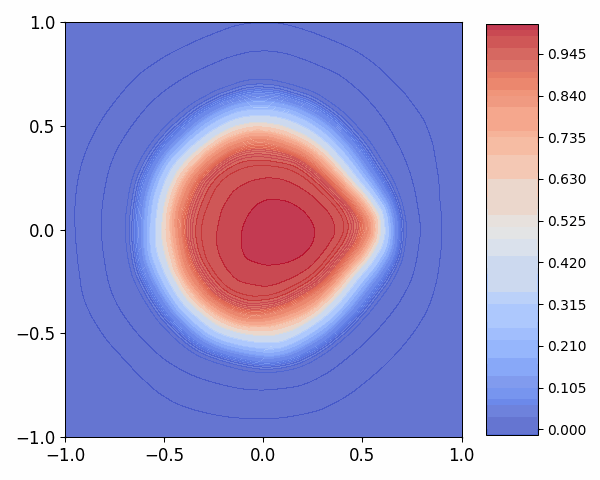

   

This is the github repo for the paper "**Fourier Multi-Component and Multi-Layer Neural Networks: Unlocking High-Frequency Potential.**"

# Abstract

The two most critical ingredients of a neural network are its structure and the activation function employed, and more importantly, the proper alignment of these two that is conducive to the effective representation and learning in practice.
In this work, we introduce a surprisingly effective synergy, termed the Fourier Multi-Component and Multi-Layer Neural Network (FMMNN), and demonstrate its surprising adaptability and efficiency in capturing high-frequency components. 
First, we theoretically establish that FMMNNs have exponential expressive power in terms of approximation capacity.  Next, we analyze the optimization landscape of FMMNNs and show that it is significantly more favorable compared to fully connected neural networks. Finally, systematic and extensive numerical experiments validate our findings, demonstrating that FMMNNs consistently achieve superior accuracy and efficiency across various tasks, particularly impressive when high-frequency components are present.

# Numerical experiments

In our paper, we perform extensive experiments to validate our analysis and demonstrate the effectiveness of MMNNs. Below are some selected examples; for additional examples, please refer to our paper.

1. Using an FMMNN of size (800, 400, 15) to approximate

$$
f_1(x) =0.6\sin(200\pi x) + 0.8\cos(160\pi x^2)+ \frac{1 + 8x^8}{1 + 10x^4} \cdot \left| 180x - 2 \left\lfloor \frac{180x + 1}{2} \right\rfloor \right|.
$$

Click [here](https://shijunzhang.top/file/img/html/f1.html) to see an illustation of $f_1$.

2. Using an FMMNN of size (800, 400, 15) to approximate
   
$$
f_2(x_1, x_2) = \sum_{i=1}^2 \sum_{j=1}^2 a_{ij} \sin(b_i x_i +  c_{ij} x_i x_j)\cdot  \big|\cos( b_j x_j +  d_{ij} x_i^2)\big|,
$$

where  

$$
(a_{ij}) =
\begin{bmatrix} 
  0.3 & 0.2 \\ 
  0.2 & 0.3 
\end{bmatrix},
\quad
(b_i) =
\begin{bmatrix} 
  12\pi \\  
  8\pi 
\end{bmatrix},
\quad
(c_{ij}) =
\begin{bmatrix} 
  4\pi & 18\pi \\  
  16\pi & 10\pi 
\end{bmatrix},
\quad
(d_{ij}) =
\begin{bmatrix} 
  14\pi & 12\pi \\  
  18\pi & 10\pi 
\end{bmatrix}.
$$

Click [here](https://shijunzhang.top/file/img/html/f2.html) to see an illustation of $f_2$.

